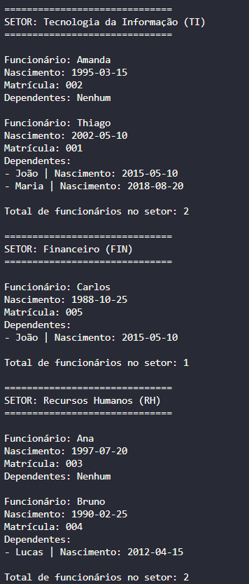

# Thiago Alves - Teste Prático Uniodonto

Projeto desenvolvido como solução para o teste técnico da Uniodonto.

A aplicação foi desenvolvida em **Java**, utilizando armazenamento de dados em memória, conceitos de **Programação Orientada a Objetos**, boas práticas de organização de código e padrões de projeto.

---

# Questão 1 - SQL

O problema apresentado consiste em identificar pessoas cadastradas na tabela `Pessoa` que não possuem uma relação correspondente na tabela `Fisica`.

Considerando que:

- `Pessoa.pess_id` é a chave primária da tabela `Pessoa`;
- `Fisica.fisc_pessoa` é uma chave estrangeira que referencia `Pessoa.pess_id`;

Foram implementadas duas soluções possíveis para encontrar pessoas sem cadastro na tabela `Fisica`.

### Solução utilizando LEFT JOIN

```sql
SELECT p.pess_id, p.Nome 
FROM Pessoa p
LEFT JOIN Fisica f ON p.pess_id = f.fisc_pessoa
WHERE f.fisc_pessoa IS NULL;
```
A consulta utiliza LEFT JOIN para retornar todos os registros da tabela Pessoa. Após o relacionamento com a tabela Fisica, são filtrados apenas os registros que não possuem correspondência.

### Solução utilizando NOT EXISTS

```sql
SELECT p.pess_id, p.Nome 
FROM Pessoa p
WHERE NOT EXISTS (
    SELECT 1 
    FROM Fisica f 
    WHERE f.fisc_pessoa = p.pess_id
);
```
A consulta utilizando NOT EXISTS verifica a ausência de registros relacionados na tabela Fisica para cada pessoa cadastrada na tabela Pessoa.

Ambas as abordagens retornam o mesmo resultado: pessoas que não possuem cadastro correspondente na tabela Fisica.

# Questão 2 - Sistema de Funcionários

### Descrição

Foi desenvolvido um sistema para gerenciamento de funcionários, contendo:

- Funcionários;
- Setores;
- Dependentes.

Cada funcionário possui:

- Nome;
- Data de nascimento;
- Matrícula;
- Setor;
- Lista de dependentes.

Cada dependente possui:

- Nome;
- Data de nascimento.

Os dados são armazenados apenas em memória, conforme solicitado no desafio.

### Estrutura do Projeto
### Estrutura do Projeto

```text
.
├── README.md
├── Questão_1.sql
│
└── src
    ├── database
    │   └── DatabaseMock.java
    │
    ├── factory
    │   └── MassaDadosFactory.java
    │
    ├── model
    │   ├── Funcionario.java
    │   ├── Dependente.java
    │   └── Setor.java
    │
    ├── service
    │   └── FuncionarioService.java
    │
    └── Main.java
```

# Como Executar

Clone o repositório:

```bash
git clone <URL_DO_REPOSITORIO>
```

Acesse o diretório do projeto:

```bash
cd prova-pratica-uniodonto
```

Compile os arquivos Java:

```bash
javac -d bin src/Main.java src/database/*.java src/factory/*.java src/model/*.java src/service/*.java
```

Execute a aplicação:

```bash
java -cp bin Main
```

## Exemplo de Saída
